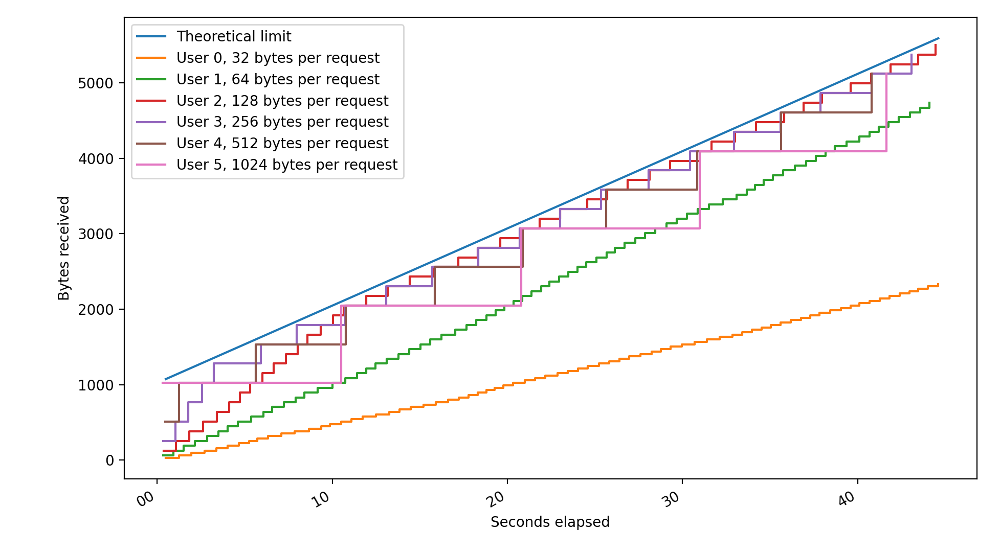

# Rate limiting API

This implementation of the assignment task intends to meet the basic requirements and the optional extension of allowing
the rate limit to differ between different clients.

## Running the app

**Requirements:**

- dotnet CLI
- .NET 5 SDK
- Python3 (optional, see below)

```shell
# build and run the server
dotnet run --project Server

# run integration tests (might take up to 3 minutes)
dotnet test
```

By default, the app listens on `https://localhost:5001` (and only HTTPS).

**Note:** The app uses a development SSL certificate. Disable certificate verification if you want to test it using e.g.
Postman.

### How you are sure the API works as intended?

The app has 98% test coverage, and rate limiting is tested in two scenarios:

- by spamming the API by multiple users at the same time.
- by spamming the API with concurrent requests from a single user.

Both scenarios run for 30 seconds, and at the end we validate whether the received number of bytes exceeds the
theoretical threshold.

Property testing with `FsCheck` is used for the `/register` endpoint, essentially fuzzing the endpoint with all sorts of
usernames and passwords to see if something breaks. Same thing is done for verifying whether the `len` query parameter
is handled correctly.

I've also hacked together a script that plots total bytes received vs time for a number of concurrent clients.

All clients were configured to use default limits (1024 bytes per 10 seconds). This results in a graph like this:



As we can see, no client can go above the theoretical threshold of `1024 + t * (1024 / 10)` bytes at time `t`. For some
clients (32 and 64 bytes per request) the limit recharges quicker than they can consume it.

To generate a plot like this, have the app running at `localhost:5001` and then:

```shell
cd extras
pip3 install -r requirements.txt
python3 plot_rate_limit.py
```

## Design decisions

### What this app is not

Due to limited time, no effort has been put towards making this app "production ready", in particular:

- No persistence – I use EFCore, but with an in-memory provider, user accounts are ephemeral.
- No Redis – rate limits for each user are simply stored in a dictionary.

However, thanks to heavy use of DI, both the user storage and the rate limit cache can be easily replaced with something
more scalable.

### User management

Since we are using BasicAuth for authentication, we need to store a table of users. A user has a username, a password,
and a unique user ID assigned to them (used as a primary key).

User passwords are hashed and salted for storage using an implementation of the Argon2id algorithm from the .NET port
of `NaCl`, `libsodium-core`. The default parameters are set to 128MB of memory and an iteration count of 6 – comfortably
more than
what [OWASP is suggesting](https://cheatsheetseries.owasp.org/cheatsheets/Password_Storage_Cheat_Sheet.html#argon2id).

We enforce some requirements for the credentials:

- a username must be 6 to 64 characters in length – there are arbitrary limits
- a password must be 8 to 64 characters in length – avoiding weak passwords and long password DOS attacks
- neither can contain the colon symbol (`:`) – allowing one of the credentials to contain it still allows for parsing
  BasicAuth headers, but this is just for simplicity

A `/register` POST endpoint is exposed for registering a new user. It expects a JSON object:

```json
{
  "username": "some username",
  "password": "some password"
}
```

A success results in `200 OK` with a JSON object containing the registered client ID:

```json
{
  "clientID": 1
}
```

Failure to register a new user results in `400 Bad Request` with a list of errors:

```json
{
  "username": [
    "Username already in use"
  ]
}
```

**NOTE:** Prohibiting users from registering a new account every millisecond is out of scope of this task.

### Randomness API

A `/random?len=xx` GET endpoint is exposed for getting a Base64-encoded array of random bytes.

The optional query parameter `len` specifies how many bytes of randomness to return. The value of this parameter cannot
be lower than the default.

An incoming request must have a `X-Client-ID` header with a valid user ID, and an `Authorization` header supplying that
user's credentials.

A success results in `200 OK` with a response body:

```json
{
  "random": "zpbLgeKXY/XtS5UwktwKRTwy1j/oowNxarUmaECPhGk="
}
```

Failure to authorize results in `401 Unauthorized` and an appropriate message:

```json
{
  "message": "Invalid username"
}
```

**NOTE:** Handling brute-force attacks is out of scope for this project.

The API is rate-limited for each user. By default, each user is allowed to request 1024 bytes of randomness every 10
seconds. This is configurable through the `appsettings.json` file, but it is possible to provide other configuration
providers.

All responses from `/random` from requests that passed the authentication contain a `X-Rate-Limit` header specifying how
many bytes of randomness are left for the user to request.

If a request would exceed the current rate limit, the response is `429 Too Many Requests` with an appropriate message:

```json
{
  "message": "The request would exceed the rate limit. Quota set to 1024 bytes every 10 seconds."
}
```

### Optional expansion: configurable rate limits

Per-user rate limits can be provided by any class that implements `IRateLimitConfig`. The default
implementation, `AppSettingsConfig`, uses the `appsettings.json` file. Example configuration looks like this:

```json5
{
  "RandomConfig": {
    // default size of the returned randomness
    "DefaultSize": 32,
    // default limit of bytes
    "DefaultLimit": 1024,
    // the width of the time window
    "DefaultWindow": 10,
    "LimitOverrides": {
      // user ID
      "1": {
        // custom limit (optional)
        "Limit": 512,
        // custom window (optional)
        "Window": 5
      },
      "2": {
        "Limit": 768
      },
      "4": {
        "Limit": 1536,
        "Window": 10
      }
    }
  }
}
```
